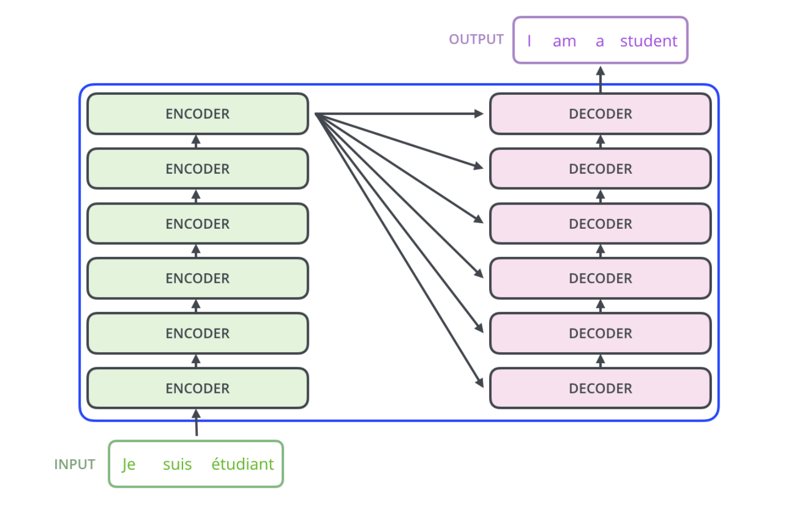
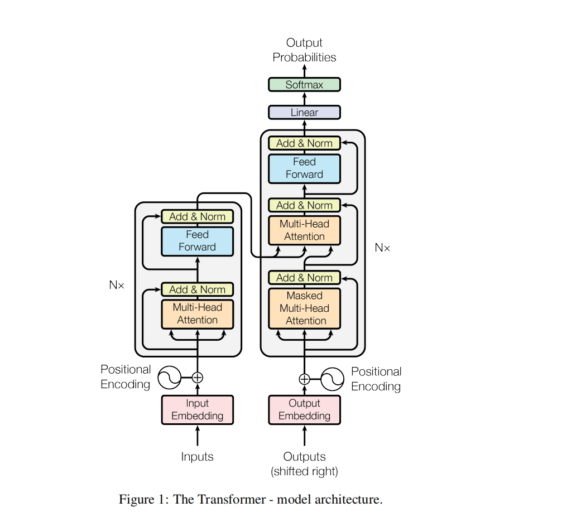

# Transformer

##  前言

## 1. 什么是Transformer

Transformer是一种基于注意力机制的深度学习模型，由Vaswani等人于2017年提出。它在自然语言处理领域取得了巨大成功，如BERT、GPT等模型都是基于Transformer架构。Transformer模型的核心是自注意力机制，它能够在不同位置的单词之间建立联系，从而更好地捕捉句子中的长距离依赖关系。

## 2. Transformer的结构

## 整体结构如下

> 由多层编码器和解码器组成，编码器和解码器均由多头自注意力机制和前馈神经网络组成。

## 单层编码器和解码器的结构如下

 > 由左侧的编码器和右侧的解码器组成，每个编码器和解码器均由多头自注意力机制和前馈神经网络组成。

### 编码器