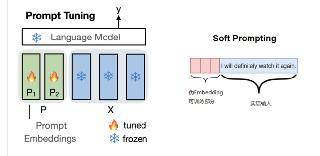

# Prompt Tuning

Prompt Tuning是一种高效的微调方法，它通过学习输入提示来调整预训练模型的参数，适用于NLP任务，如分类、问答、文本生成等。PT不需要调整原始模型参数，因此可以减小模型尺寸，提高资源利用效率。此外，Prompt Tuning不需要大量样本，适用于小规模数据集。但是，PT的性能受输入提示设计的影响，需要谨慎选择。

## 原理

+ Hard Prompt
+ Soft Prompt

## 实战

## 